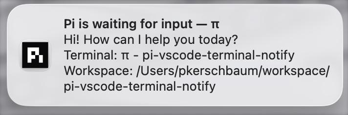

# Pi Extension — VS Code Terminal Notify

[Pi](https://pi.dev) extension that emits terminal notifications when the coding agent finishes a turn. Paired with the [VS Code extension](https://marketplace.visualstudio.com/items?itemName=patricktree.pi-vscode-terminal-notify), this enables native macOS notifications when Pi is waiting for input.



## What it does

On every `agent_end` event, this extension:

1. Extracts the last assistant text response from the conversation.
2. Truncates it to 200 characters.
3. Writes an OSC 777 `notify` escape sequence to stdout:

   ```text
   ESC ] 777 ; notify ; <title> ; <body> BEL
   ```

The VS Code extension picks up these sequences from the terminal output stream and shows a native macOS notification when the terminal is not focused.

## Installation

### 1. Install Pi package from npm

```bash
pi install pi-vscode-terminal-notification
```

### 2. Install the VS Code extension

Install the companion [VS Code extension](https://marketplace.visualstudio.com/items?itemName=patricktree.pi-vscode-terminal-notify) to receive and display notifications.

## Logging

Logs are written to `~/.pi/pi-vscode-terminal-notify/pi-extension-log.txt`.

## Attribution

Derived from Armin Ronacher's [`notify.ts`](https://github.com/mitsuhiko/agent-stuff/blob/main/pi-extensions/notify.ts) (Apache-2.0).

## Links

- [npm package](https://www.npmjs.com/package/pi-vscode-terminal-notification)
- [VS Code extension (Marketplace)](https://marketplace.visualstudio.com/items?itemName=patricktree.pi-vscode-terminal-notify)
- [Source code](https://github.com/patricktree/pi-vscode-terminal-notify)
- [Issue tracker](https://github.com/patricktree/pi-vscode-terminal-notify/issues)
- [Pi Coding Agent](https://pi.dev)
