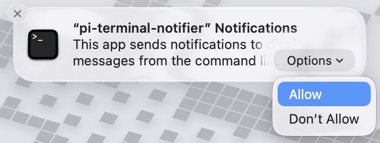

# Pi Coding Agent Notifications

VS Code extension that shows macOS notifications when the [Pi coding agent](https://pi.dev) is waiting for input and the terminal is not focused.

## Features

- Native macOS notifications when Pi finishes a turn and the terminal is not visible.
- Click a notification to focus the owning VS Code window and terminal.
- Notifications auto-dismiss when you switch to the terminal yourself.
- Grouped per terminal — new notifications replace stale ones.

## Requirements

- **macOS** — this extension uses native macOS notifications and is not available on other platforms.
- **[Pi extension](https://github.com/patricktree/pi-vscode-terminal-notify/tree/main/packages/pi-extension)** — a companion Pi package that emits [OSC 777](https://iterm2.com/documentation-escape-codes.html) escape sequences when Pi finishes a turn. Without it, the VS Code extension has nothing to listen for.

## Installation

1. Install this extension from the [Marketplace](https://marketplace.visualstudio.com/items?itemName=patricktree.pi-vscode-terminal-notify).
2. Install the [Pi extension](https://github.com/patricktree/pi-vscode-terminal-notify/tree/main/packages/pi-extension) so the Pi coding agent emits notifications on `agent_end`.
3. On first use, macOS shows a permission dialog — click **Allow**:
   

## How it works

1. The Pi extension writes an OSC 777 `notify` escape sequence to the terminal when Pi finishes a turn.
2. This VS Code extension reads the terminal output stream and parses OSC 777 sequences (including tmux passthrough-wrapped ones).
3. If the terminal is not focused, a native macOS notification is shown. Clicking it brings the VS Code window and terminal to the foreground.

## Troubleshooting

### Notifications not appearing

- **Notification permissions** — open **System Settings → Notifications**, find **pi-terminal-notifier**, and enable **Allow Notifications**.
- **Pi extension not installed** — the VS Code extension only listens; the Pi extension must be installed to emit the OSC 777 sequences. See [Pi extension setup](https://github.com/patricktree/pi-vscode-terminal-notify/tree/main/packages/pi-extension).
- **Terminal is focused** — notifications are intentionally suppressed when the Pi terminal is already visible and focused.

### Checking logs

Logs are written to the **"Pi Terminal Notify"** output channel — open it via **Command Palette → Output: Show Output Channel → Pi Terminal Notify**.

## Attribution

Derived from Pan Wenbo's [`vscode-terminal-osc-notifier`](https://github.com/wbopan/vscode-terminal-osc-notifier) (MIT).

## Links

- [Source code](https://github.com/patricktree/pi-vscode-terminal-notify)
- [Issue tracker](https://github.com/patricktree/pi-vscode-terminal-notify/issues)
- [Pi coding agent](https://pi.dev)
